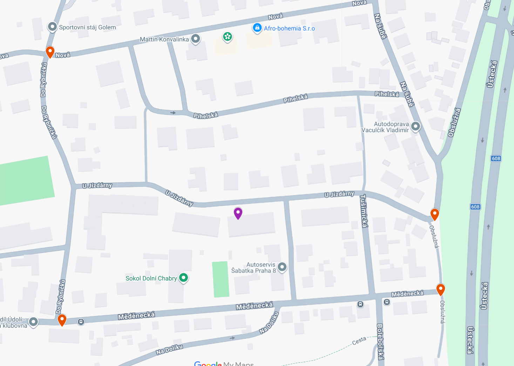

Tato mapa zobrazuje nejbližší stanoviště kontejnerů na tříděný odpad v okolí. Můžete zde snadno najít umístění kontejnerů na papír, plast, sklo a další druhy odpadu. Třídění odpadu je důležitým krokem k ochraně životního prostředí – pomáhá šetřit přírodní zdroje, snižuje množství odpadu na skládkách a zajišťuje recyklaci materiálů, které lze znovu využít. Díky správnému třídění každý z nás přispívá k udržitelnosti a zdravějšímu životnímu prostředí.

